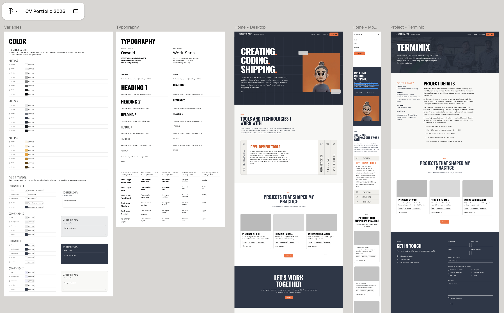

# helloitsalbert.es

Personal portfolio site for Albert Flores — frontend developer with 8+ years of experience across React, TypeScript, and WordPress.

**Live site → [helloitsalbert.es](https://helloitsalbert.es/)**

---

## What this is

This portfolio was conceived, designed in Figma, and developed entirely from scratch. Every component, interaction, asset, and design decision was created by me. UX and UI design are a core part of my frontend practice and a discipline I genuinely enjoy, so the project was an opportunity to explore the full process from concept to implementation. The goal was to create something that reflects how I work: thoughtful, detail-oriented, performant, and visually refined.

That same mindset extends to the site's visual identity. The 3D avatar featured in the hero section was modelled and rigged in Blender, then animated through an AI-assisted pipeline built with ComfyUI. Rather than relying on stock assets or static imagery, I chose to create something unique that better reflects both my approach to frontend development and my broader interest in areas such as 3D art, procedural workflows, and creative tooling.

---

## Design process

The site started in Figma — layout, typography, colour system, and components were all defined before writing a line of code. The Figma file drove every implementation decision, from spacing tokens to responsive breakpoints.

---

## Tech stack

| Layer | Choice |
|---|---|
| Framework | React 19 + TypeScript |
| Bundler | Vite (SWC) |
| Styling | Tailwind CSS 4.2 + CSS Modules |
| Routing | React Router 7 |
| Contact backend | Netlify Functions + EmailJS |
| Design | Figma |
| 3D & animation | Blender + ComfyUI |
| Image production | Affinity Creative Suite |
| Testing | Vitest + Testing Library |

---

## Architecture decisions

**Data-driven project pages** — project content lives in `src/data/projects.ts` as typed structs with Markdown detail fields. Adding a new project requires no component changes.

**Scroll animations via a custom hook** — `useScrollAnimation` wraps IntersectionObserver and returns a `{ ref, isVisible }` tuple. Components own their animation trigger without coupling to a global scroll context.

**Serverless contact form** — the contact form posts to a Netlify Function (`netlify/functions/send-email`) rather than calling EmailJS directly from the client, keeping API credentials server-side.

**CSS Modules for stateful UI** — components with complex hover/transition states (navbar links, project cards) use CSS Modules to keep animation logic scoped and away from Tailwind utility noise.

---

## Custom hooks

| Hook | Purpose |
|---|---|
| `useScrollAnimation` | IntersectionObserver wrapper — returns `{ ref, isVisible }` so components own their scroll trigger without a global context |
| `useMediaQuery` | Reactive breakpoint detection via `window.matchMedia` |
| `useDocumentTitle` | Sets per-page document title and resets to the base title on unmount |

---

## Project highlights

| Project | Summary |
|---|---|
| **Personal Website** | This site — React/TS frontend, custom 3D avatar, Figma design system |
| **Tokize** | Crypto platform with live CoinMarketCap data and custom Gutenberg blocks |
| **Terminix Canada** | 6 regional sites unified → 505% organic growth, 395% lead increase |
| **Merry Maids Canada** | 40+ franchise sites from a single WordPress master template |

---

## Author

**Albert Flores** — [helloitsalbert.es](https://helloitsalbert.es/) · [LinkedIn](https://www.linkedin.com/in/albert-flores/) · [GitHub](https://github.com/AlbertFlo)
